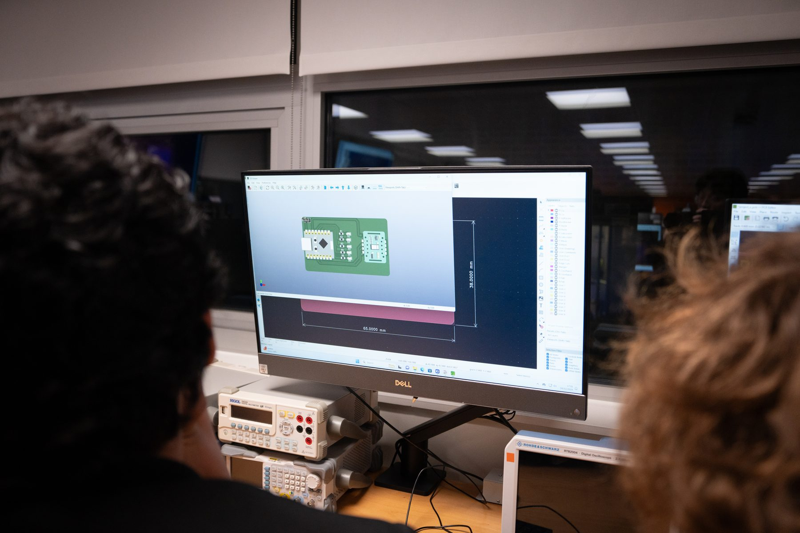
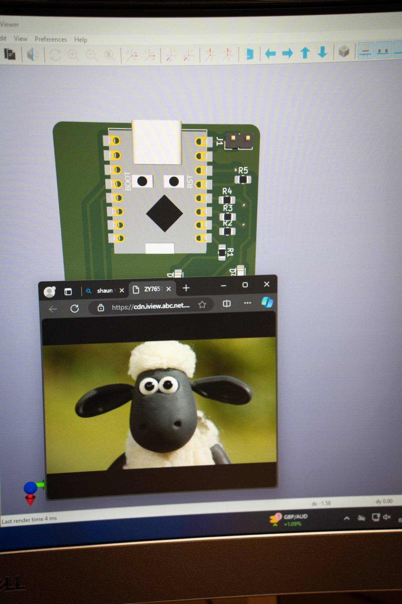
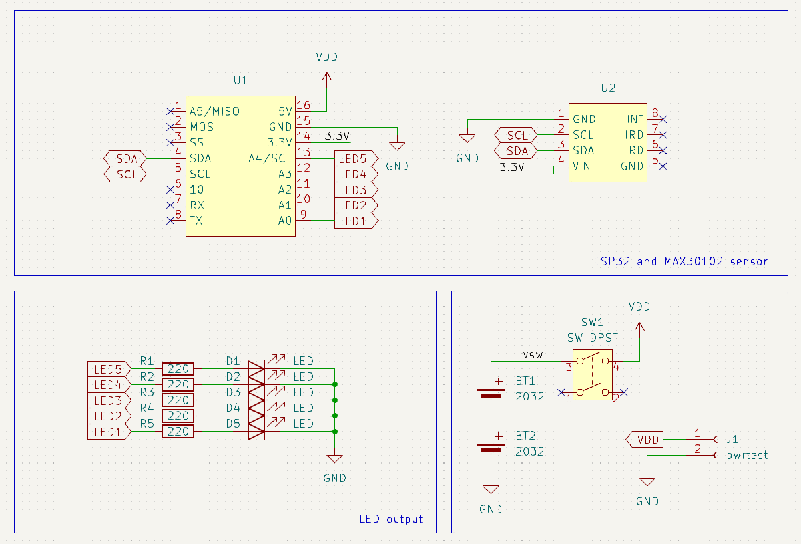

# Mood Credit Card

An educational electronics project from Fleming Society's 2024 Project X
programme. Participants use an ESP32-C3, a MAX30102 optical pulse sensor and
five LEDs to learn embedded programming, signal processing and PCB design.

> [!IMPORTANT]
> This is an educational demonstration, not a medical device. Heart-rate
> readings must not be used for diagnosis, monitoring or treatment.

## At a glance

| Item | Details |
| --- | --- |
| Programme | Project X 2024 |
| Topics | Arduino, ESP32-C3, sensors, I2C, signal processing and PCB design |
| Main hardware | ESP32-C3 SuperMini, MAX30102 module, five LEDs and five 220 Ω resistors |
| Firmware | Arduino sketch using the DevXplained MAX3010x Sensor Library |
| Design tools | KiCad, SolidWorks and a retained legacy DesignSpark PCB file |
| Current status | Recovered 2024 teaching pack; technical revalidation is required before another delivery |

## Project preview

| Project X workshop | Mood Credit Card model |
| --- | --- |
|  |  |

### Circuit schematic



## Start here

- **Learners:** begin with the [session materials](docs/learner/README.md),
  then open the [student firmware](firmware/student/mood_credit_card/).
- **Instructors:** read the [instructor notes](docs/instructor/README.md) and
  recovered session plans before preparing a session.
- **Hardware contributors:** read the [hardware guide](hardware/README.md)
  before editing or manufacturing the PCB.

PDF handouts survive for sessions 1, 3 and 5. Session 2 now has its recovered
agenda and I2C example code. Session 5 also has editable helper slides and an
instructor plan. No separate Session 4 handout was found in the source archive.

## Repository structure

```text
.
|-- docs/             # Learner and instructor material
|-- firmware/         # Maintained code, examples and historical snapshots
|-- hardware/         # Current CAD, enclosure source and historical revisions
|-- private/          # Local-only records and raw source archives, ignored by Git
|-- third_party/      # Imported material and preserved licence texts
|-- CONTRIBUTING.md
|-- LICENSE
`-- NOTICE.md
```

This layout is intended to be reused across Fleming Society projects:
documentation in `docs/`, runnable code in `firmware/`, editable engineering
source in `hardware/`, and personal or operational records outside the public
Git history.

## Recovered 2024 material

| Material | Location | Notes |
| --- | --- | --- |
| Learner handouts, PCB guide and I2C slides | [`docs/learner/2024/`](docs/learner/2024/) | Original 2024 files; review before reuse |
| Instructor agendas and plans | [`docs/instructor/2024/`](docs/instructor/2024/) | Session 2 and Session 5 material recovered |
| I2C Arduino examples | [`firmware/examples/session-02/`](firmware/examples/session-02/) | Arduino Uno slave and ESP8266 master |
| Learner KiCad project | [`hardware/kicad/learner/`](hardware/kicad/learner/) | Complete source set recovered; not yet revalidated |
| Enclosure CAD | [`hardware/enclosure/`](hardware/enclosure/) | SolidWorks source and STL exports |
| Historical PCB revisions | [`hardware/archive/2024/`](hardware/archive/2024/) | Seven labelled development stages; caches and automatic backups omitted |

## Software setup

1. Install the Arduino IDE and ESP32 board support.
2. Install the
   [MAX3010x Sensor Library](https://github.com/devxplained/MAX3010x-Sensor-Library)
   by DevXplained.
3. Open
   `firmware/student/mood_credit_card/mood_credit_card.ino`.
4. Select the correct ESP32-C3 board and port.
5. Compile before connecting the workshop PCB.

The exact Arduino ESP32 core and library versions used in 2024 were not
recorded. Pin these versions after the firmware is revalidated.

## Validation status

| Area | Status | Required action |
| --- | --- | --- |
| Learner materials | Recovered from 2024 | Review wording, links and software screenshots |
| Student firmware | Not recently compiled | Confirm board target, library version and sampling behaviour |
| Learner KiCad project | Source set recovered | Open in the intended KiCad version; run ERC and DRC |
| Exemplar KiCad design | Source preserved | Compare with an approved fabricated board |
| Enclosure CAD | Source and STL variants recovered | Confirm assembly references, fit and preferred revision |
| Component 3D models | Withheld pending licence review | Replace with redistributable models and document provenance |
| Gerbers | Current and historical sets preserved | Identify the approved set before manufacturing |
| Bill of materials | 2024 workbook preserved | Review prices, part numbers and substitutions |
| Risk assessment | Missing | Add the current session risk assessment and supervision notes |

## Safety

- Power the board only from the documented low-voltage USB supply.
- Inspect assembled boards for shorts before connecting them to a computer.
- Do not look directly into the pulse sensor LEDs at close range.
- Follow the venue's soldering, ESD and tool-safety procedures.
- Do not collect or publish participants' health readings or attendance data.

## Contributing

See [CONTRIBUTING.md](CONTRIBUTING.md) for file-placement, privacy and review
rules.

## Licensing

Except where a file or notice says otherwise, the original teaching material,
firmware and hardware designs are available under the [MIT License](LICENSE).

Third-party material retains its original copyright and licence. See
[NOTICE.md](NOTICE.md) and the licence texts under [`third_party/`](third_party/).
